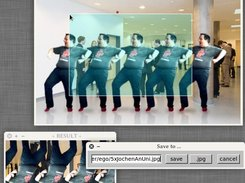

# FastCropper

**Just shows, crops and stores an image!**

My small c++ Project is based on the MIT license. It uses openCV and fltk to crop/copy an image 
region from an image (first parameter of the executable) and stores the image (input field). 
Why this program? I search very long for a small image-viewer with cropping function. I get only 
Gimp to do that on Linux, and it loads and stores not fast enough.

Because there is fltk and openCV on Windows and Mac, it should be possible to compile it on 
other systems than Linux.

**UPDATE** Yes! I create a 32bit X86 Windows Version of fastCropper and a 
Make-Batch file, how I did it. Because of the VisualC compiler, you need a msvcr120.dll which is part 
of the VisualStudio 2013 redistributeable / runtime Package.

[Download here](https://sourceforge.net/projects/fastcropper/files/)

## Features

- shows an image file
- crops a region of an image file and replace/stores it
- support for png, jpeg and all openCV image formats
- uses openCV and fltk
- Makefile included
- should be compile able on many systems
- minimalistic code and program size
- very easy and unprofessional kick-ass c++ code

## Usage

- right click on the image file (your system display something like "open with...")
- select the Executeable `fastCropper(.exe)` to open the image file with it
- first click on image (not the preview window) (re-)starts cropping
- second click on image stop cropping
- right click: dialog to store or rewrite the cropped result
